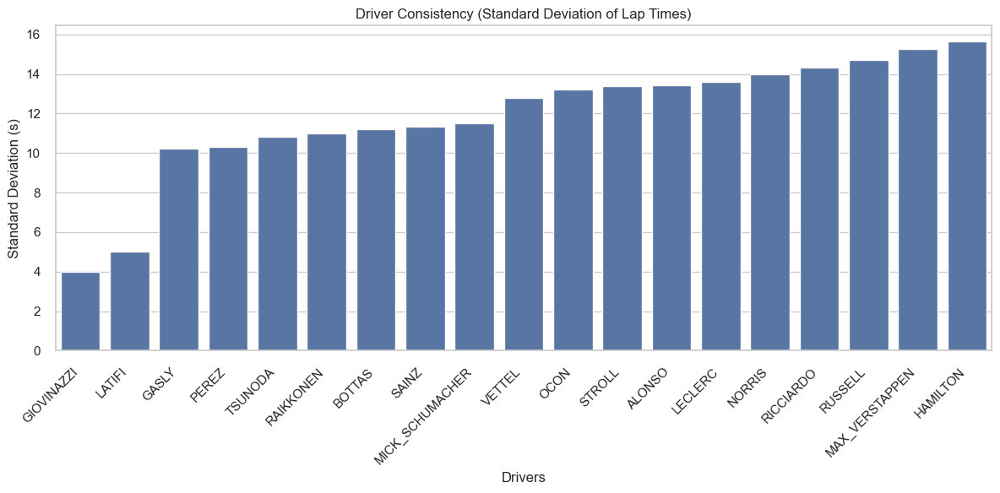
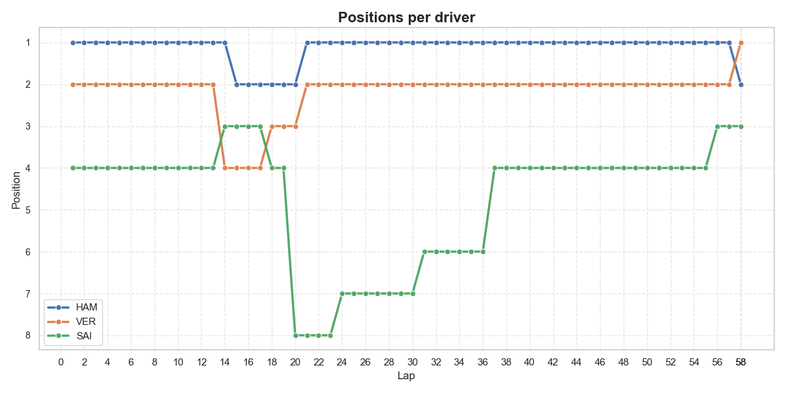
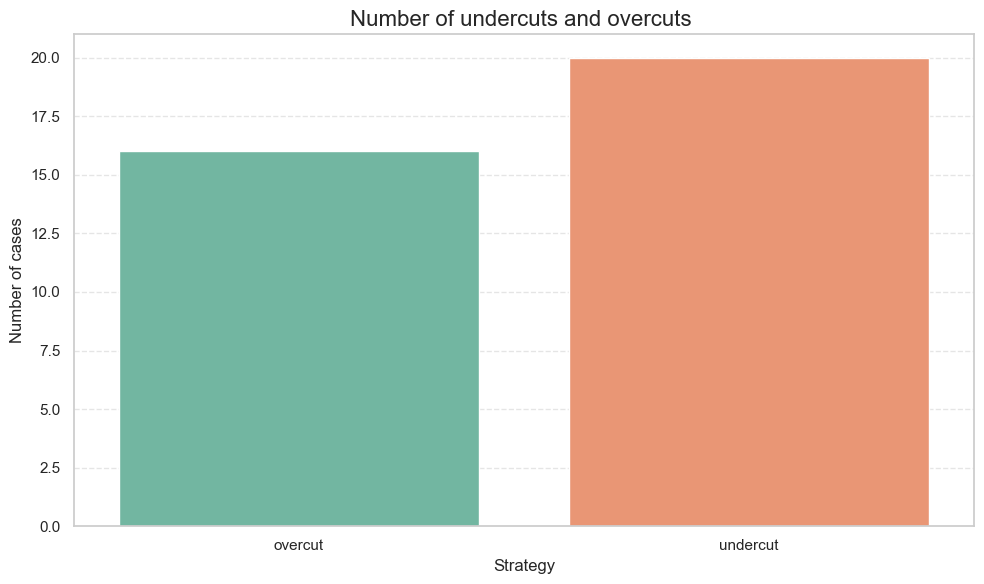

# 🏁 F1 Race Analysis with Python 🏎️

**2021 Abu Dhabi Grand Prix – Consistency & Strategy Study**

This project leverages real Formula 1 race data to perform an in-depth analysis of driver consistency, race dynamics, and pit stop strategies during one of the most controversial races in recent history — the 2021 Abu Dhabi Grand Prix.

---

## 📊 Project Highlights

- 🚗 **Driver consistency**: per-lap standard deviation as a metric of pace stability
  


- 🏎️ **Position evolution**: track how driver positions changed throughout the race
  

  
- 🔧 **Pit stop strategy**: detection of undercuts and overcuts
  


---

## ⚙️ Installation & Setup

#### 1. Clone the repository

```bash
git clone [https://github.com/your-username/f1-race-analysis.git](https://github.com/Gabryel-Januario/F1-Race-Analysis-with-Python)
cd F1-Race-Analysi-with-Python
```

#### 2. (Optional) Create a virtual environment

```bash
- python -m venv .venv
- source .venv/bin/activate      # macOS/Linux
- .venv\\Scripts\\activate       #Windows
```

#### 3. Install dependencies

```bash
pip install -r requirements.txt
```

---

## 🧪 Running the Analysis

#### 1. Open Jupyter:

```bash
jupyter notebook
```

### 2. Navigate to notebooks/f1_main_analysis.ipynb.

#### 3. Run all cells (Kernel > Restart & Run All).

---

## Sample Insights

- Antonio Giovinazzi showed the most consistent lap times.

- Lewis Hamilton had the highest lap-time variability, likely due to tire strategy and race incidents.

- Undercut strategies were slightly more frequent and effective than overcuts.

---

## 🧠 Skills Demonstrated

- Data cleaning and exploration (pandas, numpy)

- Visualization (matplotlib, seaborn)

- Domain-specific modeling (F1 strategy logic)

- Modular Python structuring for reusability

- Clear storytelling through notebooks

---

## 📚 Data Sources

Data used in this project is assumed to be from the Ergast Developer API or preprocessed offline.

---

## 📄 License

MIT License © Your Name
Feel free to use, fork, and adapt the project — just give proper credit!
